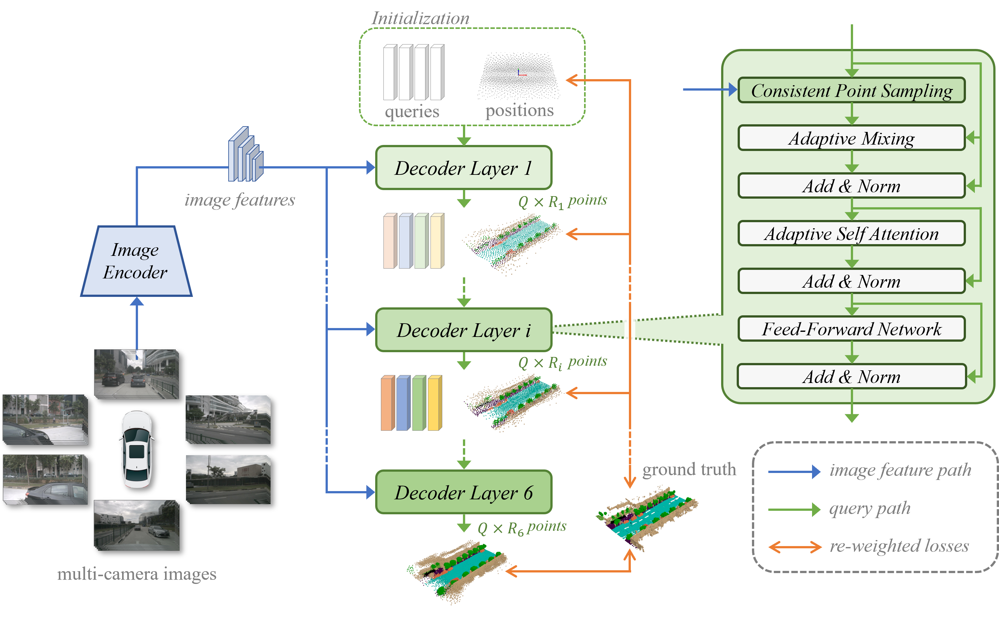
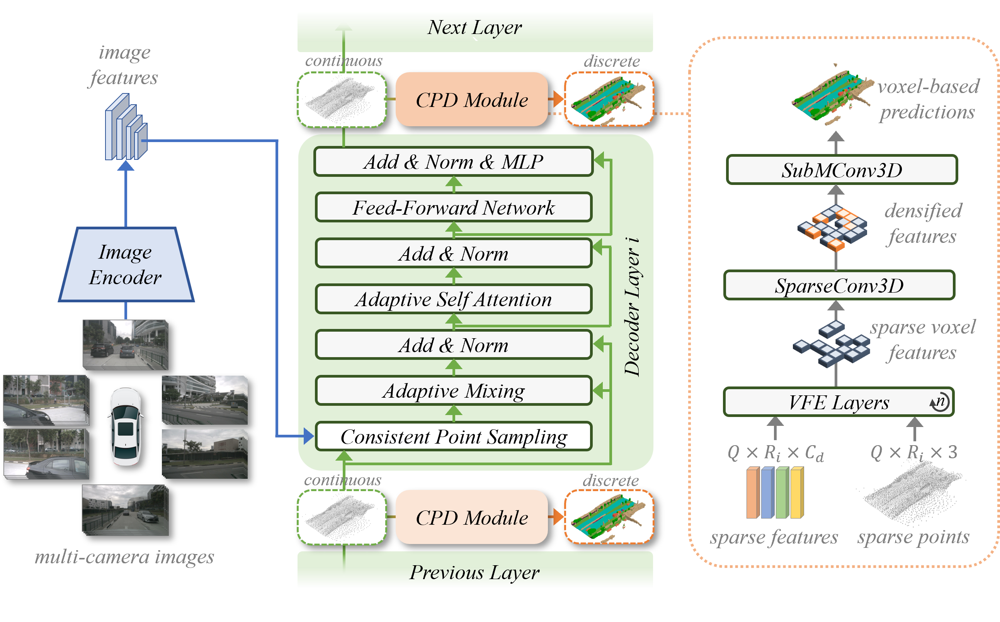
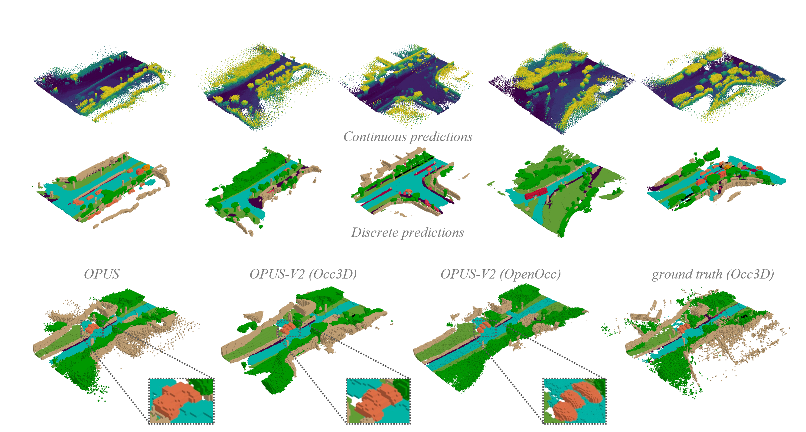
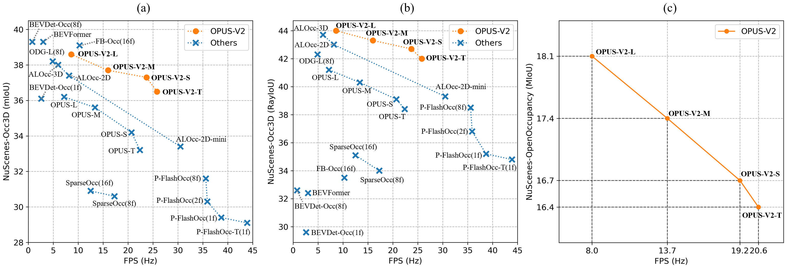

<div align="center">

# OPUS: Occupancy Prediction Using a Sparse Set
</div>


> **OPUS: Occupancy Prediction Using a Saprse Set**
> - Authors: [Jiabao Wang*](https://jbwang1997.github.io/),
> [Zhaojiang Liu*](https://agito555.github.io/),
> [Qiang Meng](https://irvingmeng.github.io/), Liujiang Yan, Ke Wang,
> [Jie Yang](http://www.pami.sjtu.edu.cn/jieyang),
> [Wei Liu](http://www.pami.sjtu.edu.cn/weiliu),
> [Qibin Hou#](https://houqb.github.io/),
> [Ming-Ming Cheng](https://mmcheng.net/cmm/)
> | [arXiv](https://arxiv.org/pdf/2409.09350) | [知乎](https://zhuanlan.zhihu.com/p/721102233)

> **OPUS-V2: Bridging the Gap between Continuous and Discrete Occupancy**
> - Authors: [Jiabao Wang*](https://jbwang1997.github.io/),
> [Qiang Meng](https://irvingmeng.github.io/), Liujiang Yan, Ke Wang,
> [Qibin Hou#](https://houqb.github.io/),
> [Ming-Ming Cheng](https://mmcheng.net/cmm/)
> | [arXiv](https://arxiv.org/pdf/2409.09350) | [知乎](https://zhuanlan.zhihu.com/p/1960850122750550870)

> (* Equal contribition, # Corresponding author)

## News

- [2026/01/06]: &#x1F680; We release the code and model of OPUS-V2, achieving 38.6 mIoU and 44.0 RayIoU on the NuScene-Occ3D dataset. The [Jittor](https://github.com/Jittor/jittor) version of OPUS is also under implementation. &#x1F680;&#x1F680;&#x1F680; please stay tuned. 
- [2025/09/18]: We release the pretrained models of OPUS-Fusion.
- [2025/02/10]: &#x1F680; We release the fusion version of OPUS. The performance has been boosted to 51.4 mIoU and 51.8 RayIoU on the NuScene-Occ3D dataset.
- [2025/01/10]: We release the visualization code.
- [2024/09/26]: &#x1F680; OPUS is accepeted by NeurIPS 2024.
- [2024/09/17]: &#x1F680; We release an initial version of OPUS. It achieves promising performance of 41.2 RayIoU and 36.2 mIoU on the NuScene-Occ3D dataset.

## Introduction

<details>
<summary>OPUS: Occupancy Prediction Using a Sparse Set</summary>
Occupancy prediction, aiming at predicting the occupancy status within voxelized 3D environment, is quickly gaining momentum within the autonomous driving community.
Mainstream occupancy prediction works first discretize the 3D environment into voxels, then perform classification on such dense grids. However, inspection on sample data reveals that the vast majority of voxels is unoccupied. Performing classification on these empty voxels demands suboptimal computation resource allocation, and reducing such empty voxels necessitates complex algorithm designs.
To this end, we present a novel perspective on the occupancy prediction task: formulating it as a streamlined set prediction paradigm without the need for explicit space modeling or complex sparsification procedures.
Our proposed framework, called OPUS, utilizes a transformer encoder-decoder architecture to simultaneously predict occupied locations and classes using a set of learnable queries.
Firstly, we employ the Chamfer distance loss to scale the set-to-set comparison problem to unprecedented magnitudes, making training such model end-to-end a reality.
Subsequently, semantic classes are adaptively assigned using nearest neighbor search based on the learned locations.
In addition, OPUS incorporates a suite of non-trivial strategies to enhance model performance, including coarse-to-fine learning, consistent point sampling, and adaptive re-weighting, etc.
Finally, compared with current state-of-the-art methods, our lightest model achieves superior RayIoU on the Occ3D-nuScenes dataset at near 2X FPS, while our heaviest model surpasses previous best results by 6.1 RayIoU. 

</details>

<details>
<summary>OPUS-V2: Bridge the Gap between Continuous and Discrete Occupancy</summary>
State-of-the-art occupancy prediction methods often achieve high accuracy at the cost of significant computational expense, thus hindering their spatial extension.
While the recent OPUS framework introduced an efficient point-set prediction paradigm, its accuracy trails behind more complex models. 
In this paper, we identify a representation gap problem of OPUS between its continuous predictions and the discrete ground-truth voxels.
This gap necessitates manually constructed intermediates, which introduce training instability and additional errors.
To mitigate this problem, this paper proposes OPUS-V2, which incorporates a lightweight Continuous Prediction Discretization (CPD) module behind the decoder.
The CPD adaptively maps continuous predictions into the discrete voxel space, obviating the need for suboptimal handcrafted intermediates and thereby enhancing model accuracy.
Furthermore, our architecture decouples the feature and occupancy generation processes, allowing OPUS-V2 to adapt to arbitrary resolutions. 
OPUS-V2 achieves a state-of-the-art RayIoU of 44.0 on the Occ3D dataset.
On the more challenging OpenOccupancy dataset, it attains a competitive 16.4 mIoU while running at a real-time 20.6 FPS.

</details>

## Results

- Comparison between different type of predictions



- Occupancy prediction in long term.

https://github.com/user-attachments/assets/f75b54db-a05e-4316-9ba8-9a7e5dbbbf3f

## Model Zoo



<details>
<summary>Camera only OPUS-V2 on NuScene-Occ3D dataset</summary>
<table>
    <tr>
        <td>Models</td>
        <td>Epochs</td>
        <td><i>Q</i></td>
        <td><i>P</i></td>
        <td>mIoU</td>
        <td>RayIoU1m</td>
        <td>RayIoU2m</td>
        <td>RayIoU4m</td>
        <td>RayIoU</td>
        <td>FPS</td>
        <td>Link</td>
    </tr>
    <tr>
        <td><a href="configs/opusv2_nusc-occ3d/opusv2-t_r50_704x256_8f_nusc-occ3d_100e.py">OPUS-V2-T</a></td>
        <td>100</td>
        <td>600</td>
        <td>128</td>
        <td>36.5</td>
        <td>35.8</td>
        <td>42.8</td>
        <td>47.3</td>
        <td>42.0</td>
        <td>25.8</td>
        <td><a href="https://huggingface.co/jbwang1997/OPUS">Model</a></td>
    </tr>
    <tr>
        <td><a href="configs/opusv2_nusc-occ3d/opusv2-s_r50_704x256_8f_nusc-occ3d_100e.py">OPUS-V2-S</a></td>
        <td>100</td>
        <td>1200</td>
        <td>64</td>
        <td>37.3</td>
        <td>36.7</td>
        <td>43.5</td>
        <td>47.8</td>
        <td>42.7</td>
        <td>23.7</td>
        <td><a href="https://huggingface.co/jbwang1997/OPUS">Model</a></td>
    </tr>
    <tr>
        <td><a href="configs/opusv2_nusc-occ3d/opusv2-m_r50_704x256_8f_nusc-occ3d_100e.py">OPUS-V2-M</a></td>
        <td>100</td>
        <td>2400</td>
        <td>32</td>
        <td>37.7</td>
        <td>37.2</td>
        <td>44.3</td>
        <td>48.5</td>
        <td>43.3</td>
        <td>16.0</td>
        <td><a href="https://huggingface.co/jbwang1997/OPUS">Model</a></td>
    </tr>
    <tr>
        <td><a href="configs/opusv2_nusc-occ3d/opusv2-l_r50_704x256_8f_nusc-occ3d_100e.py">OPUS-V2-L</a></td>
        <td>100</td>
        <td>4800</td>
        <td>16</td>
        <td>38.6</td>
        <td>38.0</td>
        <td>45.0</td>
        <td>49.2</td>
        <td>44.0</td>
        <td>8.6</td>
        <td><a href="https://huggingface.co/jbwang1997/OPUS">Model</a></td>
    </tr>
</table>
</details>

<details>
<summary>Camera only OPUS-V2 on NuScene-OpenOccupancy dataset</summary>
<table>
    <tr>
        <td>Models</td>
        <td>IoU</td>
        <td>MIoU</td>
        <td>barrier</td>
        <td>bicycle</td>
        <td>bus</td>
        <td>car</td>
        <td>const. veh.</td>
        <td>motorcycle</td>
        <td>pedestrian</td>
        <td>traffic cone</td>
        <td>trailer</td>
        <td>truck</td>
        <td>drive. suf.</td>
        <td>other flat</td>
        <td>sidewalk</td>
        <td>terrain</td>
        <td>manmade</td>
        <td>vegetation</td>
        <td>FPS</td>
        <td>Link</td>
    </tr>
    <tr>
        <td><a href="configs/opusv2_nusc-occupancy/opusv2-t_r50_704x256_8f_nusc-occupancy_50e.py">OPUS-V2-T</a></td>
        <td>27.4</td>
        <td>16.4</td>
        <td>17.5</td>
        <td>7.5</td>
        <td>16.2</td>
        <td>18.9</td>
        <td>10.4</td>
        <td>11.7</td>
        <td>6.9</td>
        <td>6.5</td>
        <td>8.2</td>
        <td>14.9</td>
        <td>39.3</td>
        <td>27.3</td>
        <td>25.4</td>
        <td>23.2</td>
        <td>11.7</td>
        <td>16.4</td>
        <td>20.6</td>
        <td><a href="https://huggingface.co/jbwang1997/OPUS">Model</a></td>
    </tr>
    <tr>
        <td><a href="configs/opusv2_nusc-occupancy/opusv2-s_r50_704x256_8f_nusc-occupancy_50e.py">OPUS-V2-S</a></td>
        <td>27.6</td>
        <td>16.7</td>
        <td>17.0</td>
        <td>9.1</td>
        <td>15.8</td>
        <td>19.2</td>
        <td>10.1</td>
        <td>12.7</td>
        <td>8.1</td>
        <td>8.0</td>
        <td>8.1</td>
        <td>14.9</td>
        <td>39.6</td>
        <td>27.0</td>
        <td>25.8</td>
        <td>23.8</td>
        <td>11.6</td>
        <td>16.6</td>
        <td>19.2</td>
        <td><a href="https://huggingface.co/jbwang1997/OPUS">Model</a></td>
    </tr>
    <tr>
        <td><a href="configs/opusv2_nusc-occupancy/opusv2-m_r50_704x256_8f_nusc-occupancy_50e.py">OPUS-V2-M</a></td>
        <td>27.9</td>
        <td>17.4</td>
        <td>18.5</td>
        <td>11.2</td>
        <td>15.9</td>
        <td>19.5</td>
        <td>10.5</td>
        <td>13.8</td>
        <td>9.4</td>
        <td>9.3</td>
        <td>8.2</td>
        <td>15.3</td>
        <td>39.8</td>
        <td>27.5</td>
        <td>26.2</td>
        <td>23.8</td>
        <td>12.4</td>
        <td>17.1</td>
        <td>13.7</td>
        <td><a href="https://huggingface.co/jbwang1997/OPUS">Model</a></td>
    </tr>
    <tr>
        <td><a href="configs/opusv2_nusc-occupancy/opusv2-l_r50_704x256_8f_nusc-occupancy_50e.py">OPUS-V2-L</a></td>
        <td>28.7</td>
        <td>18.1</td>
        <td>19.3</td>
        <td>11.5</td>
        <td>16.4</td>
        <td>19.9</td>
        <td>11.8</td>
        <td>15.0</td>
        <td>10.0</td>
        <td>10.6</td>
        <td>8.4</td>
        <td>15.8</td>
        <td>39.9</td>
        <td>27.7</td>
        <td>26.8</td>
        <td>24.5</td>
        <td>13.9</td>
        <td>18.0</td>
        <td>8.0</td>
        <td><a href="https://huggingface.co/jbwang1997/OPUS">Model</a></td>
    </tr>
</table>
</details>

<details>
<summary>Camera Lidar fusion OPUS-V1 on NuScene-Occ3D dataset</summary>
<table>
    <tr>
        <td>Models</td>
        <td>Epochs</td>
        <td><i>Q</i></td>
        <td><i>P</i></td>
        <td>mIoU</td>
        <td>RayIoU1m</td>
        <td>RayIoU2m</td>
        <td>RayIoU4m</td>
        <td>RayIoU</td>
        <td>FPS</td>
        <td>Link</td>
    </tr>
    <tr>
        <td><a href="configs/opusv1-fusion_nusc-occ3d/opusv1-fusion-t_r50_704x256_8f_nusc-occ3d_100e.py">OPUS-V1-Fus-T</a></td>
        <td>100</td>
        <td>600</td>
        <td>128</td>
        <td>48.7</td>
        <td>45.4</td>
        <td>50.3</td>
        <td>53.3</td>
        <td>49.7</td>
        <td>10.2</td>
        <td><a href="https://huggingface.co/jbwang1997/OPUS">Model</a></td>
    </tr>
    <tr>
        <td><a href="configs/opusv1-fusion_nusc-occ3d/opusv1-fusion-s_r50_704x256_8f_nusc-occ3d_100e.py">OPUS-V1-Fus-S</a></td>
        <td>100</td>
        <td>1200</td>
        <td>64</td>
        <td>49.6</td>
        <td>45.9</td>
        <td>51.0</td>
        <td>54.1</td>
        <td>50.4</td>
        <td>9.5</td>
        <td><a href="https://huggingface.co/jbwang1997/OPUS">Model</a></td>
    </tr>
    <tr>
        <td><a href="configs/opusv1-fusion_nusc-occ3d/opusv1-fusion-m_r50_704x256_8f_nusc-occ3d_100e.py">OPUS-V1-Fus-M</a></td>
        <td>100</td>
        <td>2400</td>
        <td>32</td>
        <td>50.5</td>
        <td>46.4</td>
        <td>51.2</td>
        <td>54.2</td>
        <td>50.6</td>
        <td>6.9</td>
        <td><a href="https://huggingface.co/jbwang1997/OPUS">Model</a></td>
    </tr>
    <tr>
        <td><a href="configs/opusv1-fusion_nusc-occ3d/opusv1-fusion-l_r50_704x256_8f_nusc-occ3d_100e.py">OPUS-V1-Fus-L</a></td>
        <td>100</td>
        <td>4800</td>
        <td>16</td>
        <td>51.4</td>
        <td>47.6</td>
        <td>52.4</td>
        <td>55.3</td>
        <td>51.8</td>
        <td>3.2</td>
        <td><a href="https://huggingface.co/jbwang1997/OPUS">Model</a></td>
    </tr>
</table>
</details>

<details>
<summary>Camera only OPUS-V1 on NuScene-Occ3D dataest</summary>
<table>
    <tr>
        <td>Models</td>
        <td>Epochs</td>
        <td><i>Q</i></td>
        <td><i>P</i></td>
        <td>mIoU</td>
        <td>RayIoU1m</td>
        <td>RayIoU2m</td>
        <td>RayIoU4m</td>
        <td>RayIoU</td>
        <td>FPS</td>
        <td>Link</td>
    </tr>
    <tr>
        <td><a href="configs/opusv1_nusc-occ3d/opusv1-t_r50_704x256_8f_nusc-occ3d_100e.py">OPUS-V1-T</a></td>
        <td>100</td>
        <td>600</td>
        <td>128</td>
        <td>33.2</td>
        <td>31.7</td>
        <td>39.2</td>
        <td>44.3</td>
        <td>38.4</td>
        <td>22.4</td>
        <td><a href="https://huggingface.co/jbwang1997/OPUS">Model</a></td>
    </tr>
    <tr>
        <td><a href="configs/opusv1_nusc-occ3d/opusv1-s_r50_704x256_8f_nusc-occ3d_100e.py">OPUS-V1-S</a></td>
        <td>100</td>
        <td>1200</td>
        <td>64</td>
        <td>34.2</td>
        <td>32.6</td>
        <td>39.9</td>
        <td>44.7</td>
        <td>39.1</td>
        <td>20.7</td>
        <td><a href="https://huggingface.co/jbwang1997/OPUS">Model</a></td>
    </tr>
    <tr>
        <td><a href="configs/opusv1_nusc-occ3d/opusv1-m_r50_704x256_8f_nusc-occ3d_100e.py">OPUS-V1-M</a></td>
        <td>100</td>
        <td>2400</td>
        <td>32</td>
        <td>35.6</td>
        <td>33.7</td>
        <td>41.1</td>
        <td>46.0</td>
        <td>40.3</td>
        <td>13.4</td>
        <td><a href="https://huggingface.co/jbwang1997/OPUS">Model</a></td>
    </tr>
    <tr>
        <td><a href="configs/opusv1_nusc-occ3d/opusv1-l_r50_704x256_8f_nusc-occ3d_100e.py">OPUS-V1-L</a></td>
        <td>100</td>
        <td>4800</td>
        <td>16</td>
        <td>36.2</td>
        <td>34.7</td>
        <td>42.1</td>
        <td>46.7</td>
        <td>41.2</td>
        <td>7.2</td>
        <td><a href="https://huggingface.co/jbwang1997/OPUS">Model</a></td>
    </tr>
</table>
</details>

**note: *Q* denotes query numbers. *P* is the number of predicted points per query.**

## Training and Evaluation

### Environment

We build OPUS based on Pytorch 2.2 + CUDA 12.1 + MMCV 2.2 (MMEngine stack).
```
conda create -n opus python=3.10
conda activate opus
conda install pytorch==2.2.0 torchvision==0.17.0 pytorch-cuda=12.1 -c pytorch -c nvidia
```

Install other dependencies:

```
pip install spconv-cu121  # Change the cuda version
pip install openmim
mim install mmengine
mim install mmcv==2.2.0
mim install mmdet>=3.0.0
mim install mmdet3d>=1.0.0
```

Note: Use an external `mmdet3d` (v1.x) install and **do not** add the repo-local `mmdetection3d/` to `PYTHONPATH`, otherwise you may accidentally load an old MMCV1 stack.

Install turbojpeg and pillow-simd to speed up data loading (optional but important):

```
sudo apt-get update
sudo apt-get install -y libturbojpeg
pip install pyturbojpeg
pip uninstall pillow
pip install pillow-simd==9.0.0.post1
```

Compile CUDA extensions:

```
cd models/csrc
python setup.py build_ext --inplace
```

### Prepare Dataset

1. Download nuScenes from [https://www.nuscenes.org/nuscenes](https://www.nuscenes.org/nuscenes) and place it in folder `data/nuscenes`.

2. (Optional) Download Occ3d-nuScenes from the [link](https://tsinghua-mars-lab.github.io/Occ3D/) and place it in `data/nuscenes/gts`

3. (Optional) Download Occ3d-OpenOccupancy from the [link](https://github.com/JeffWang987/OpenOccupancy/blob/main/docs/prepare_data.md) and place it in `data/nuscenes/occupancy`

4. Prepare data with scripts provided by mmdet3d:

```
mim run mmdet3d create_data nuscenes --root-path ./data/nuscenes --out-dir ./data/nuscenes --extra-tag nuscenes
```

4. Perform data preparation for OPUS:

```
python scripts/gen_sweep_info.py
```

The final folder structure would be

```
data/nuscenes
├── maps
├── nuscenes_infos_test_sweep.pkl
├── nuscenes_infos_train_sweep.pkl
├── nuscenes_infos_train_mini_sweep.pkl
├── nuscenes_infos_val_sweep.pkl
├── nuscenes_infos_val_mini_sweep.pkl
├── samples
├── sweeps
├── gts       % Occ3D dataset (Optional)
├── occupancy % OpenOccupancy dataset (Optional)
├── v1.0-test
└── v1.0-trainval
```

Note: These `*.pkl` files can also be generated with our script: `scripts/gen_sweep_info.py`.

### Training

Download pre-trained [weights](https://download.openmmlab.com/mmdetection3d/v0.1.0_models/nuimages_semseg/cascade_mask_rcnn_r50_fpn_coco-20e_20e_nuim/cascade_mask_rcnn_r50_fpn_coco-20e_20e_nuim_20201009_124951-40963960.pth)
provided by mmdet3d, and put them in directory `pretrain/`.
If you want to train OPUS-Fusion model, please download DAL-tiny pre-trained [weights](https://huggingface.co/jbwang1997/OPUS) in directory `pretrain/` and run `python scripts/gen_fusion_pretrain_model.py`.


```
pretrain
├── cascade_mask_rcnn_r50_fpn_coco-20e_20e_nuim_20201009_124951-40963960.pth
├── dal-tiny-map66.9-nds71.1.pth (optional)
├── fusion_pretrain_model.pth (optional)
```

Train OPUS with a single GPU:

```
python train.py --config configs/opusv1_nusc-occ3d/opusv1-t_r50_704x256_8f_nusc-occ3d_100e.py
```

Train OPUS with 8 GPUs:

```
bash dist_train.sh 8 configs/opusv1_nusc-occ3d/opusv1-t_r50_704x256_8f_nusc-occ3d_100e.py
```

Note: The batch size for each GPU will be scaled automatically. So there is no need to modify the `batch_size` in configurations.

### Evaluation

Single-GPU evaluation:

```
export CUDA_VISIBLE_DEVICES=0
python val.py --config configs/opusv1_nusc-occ3d/opusv1-t_r50_704x256_8f_nusc-occ3d_100e.py --weights path/to/checkpoints
```

Multi-GPU evaluation:

```
export CUDA_VISIBLE_DEVICES=0,1,2,3,4,5,6,7
bash dist_val.sh 8 configs/opusv1_nusc-occ3d/opusv1-t_r50_704x256_8f_nusc-occ3d_100e.py --weights path/to/checkpoints
```

### Visualization

Visualizing results
```
python visualize.py --config configs/opusv1_nusc-occ3d/opusv1-t_r50_704x256_8f_nusc-occ3d_100e.py --weights path/to/checkpoints
```

Visualizing inputs and ground-truths
```
python visualize.py --config configs/opusv1_nusc-occ3d/opusv1-t_r50_704x256_8f_nusc-occ3d_100e.py --weights path/to/checkpoints --vis-input --vis-gt
```

## Bibtex

If this work is helpful for your research, please consider citing the following entry.

```
@inproceedings{wang2024opus,
  title={Opus: occupancy prediction using a sparse set},
  author={Wang, Jiabao and Liu, Zhaojiang and Meng, Qiang and Yan, Liujiang and Wang, Ke and Yang, Jie and Liu, Wei and Hou, Qibin and Cheng, Mingming}
  booktitle={Advances in Neural Information Processing Systems},
  year={2024}
}
```

## Ackknowledgement

Our code is developed on top of following open source codebase:

- [SparseBEV](https://github.com/MCG-NJU/SparseBEV)
- [SparseOcc](https://github.com/MCG-NJU/SparseOcc)

We sincerely appreciate their amazing works.
